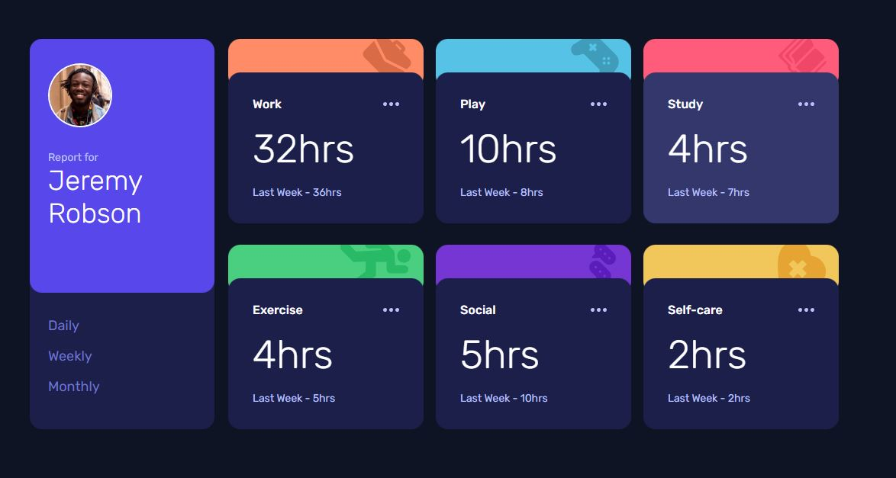

# Frontend Mentor - Time tracking dashboard solution

This is a solution to the [Time tracking dashboard challenge on Frontend Mentor](https://www.frontendmentor.io/challenges/time-tracking-dashboard-UIQ7167Jw). Frontend Mentor challenges help you improve your coding skills by building realistic projects.  

## Table of contents

- [Overview](#overview)
  - [The challenge](#the-challenge)
  - [Screenshot](#screenshot)
  - [Links](#links)
  - [Running locally](#running)
- [My process](#my-process)
  - [Built with](#built-with)
  - [Useful resources](#useful-resources)
- [Author](#author)
- [Acknowledgments](#acknowledgments)


## Overview

### The challenge

Users should be able to:

- View the optimal layout for the site depending on their device's screen size
- See hover states for all interactive elements on the page
- Switch between viewing Daily, Weekly, and Monthly stats

### Screenshot



### Links

- Live Site URL: [Github Pages](https://lanaschuster.github.io/time-tracking-dashboard/)

### Running locally

To run in development mode:

$ ```yarn```

$ ```yarn dev```

## My process

### Built with

- Scss
- [Vue.js 3](https://vuejs.org/)
- [Vite](https://vitejs.dev/)

### Useful resources

- [CSS Grid Layout](https://developer.mozilla.org/en-US/docs/Learn/CSS/CSS_layout/Grids) - This helped me to understand css grid layout.

## Author

- Linkedin - [Lana Schuster](linkedin.com/in/lana-schuster-48b896195/)
- Frontend Mentor - [@lanaschuster](https://www.frontendmentor.io/profile/lanaschuster)
